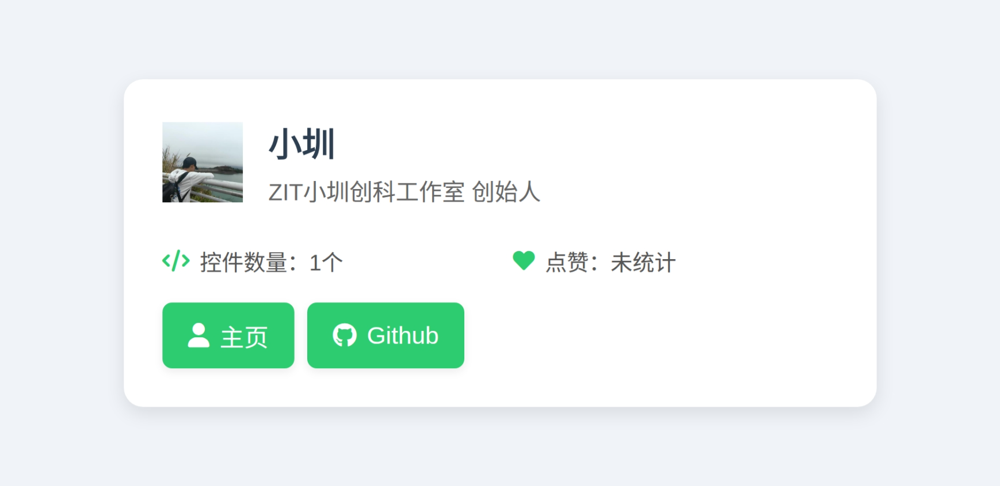
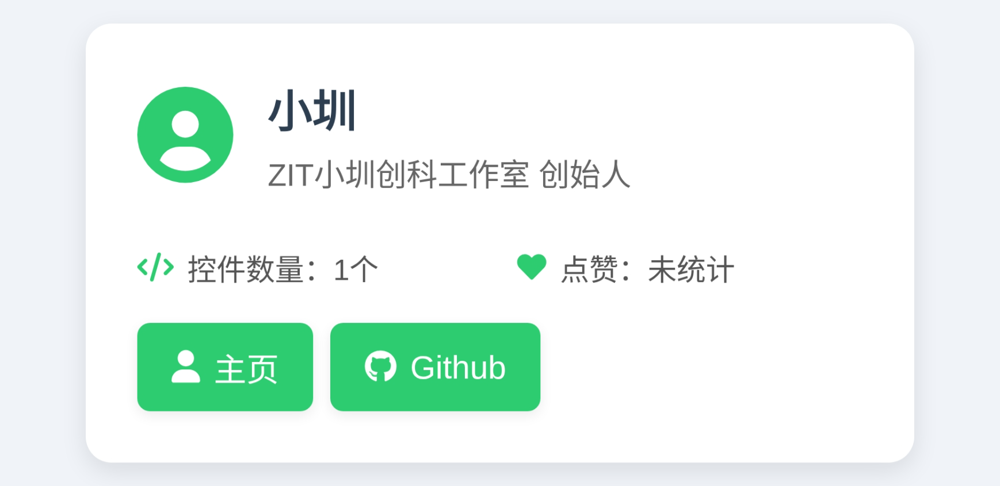
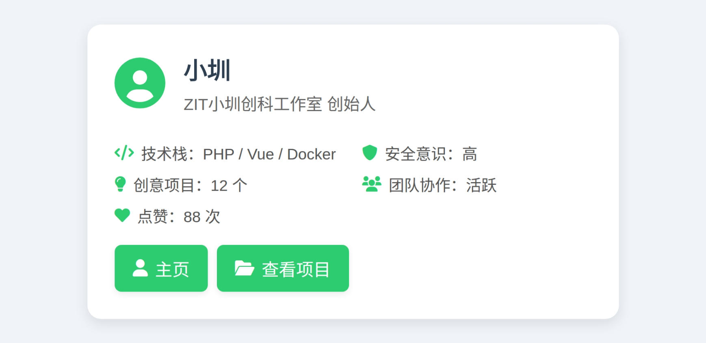

# CoCo-Community新UI设计（小圳方案专用仓库）
Hello,欢迎来到此仓库，此仓库为新CoCo-Community更新的UI做准备。  
本仓库为小圳方案，不接受PR。如果您有方案，建议前往zitzhen/CoCo-Community提交议题。  
谢谢！~  

## 目前正在设计的新UI
- 文章卡片

## 已完成设计的卡片
- 控件卡片
- 用户卡片

## UI展览
### 「用户卡片」UI展览
[展览文档](user-card/README.md)
#### 3.0版本

#### 2.0版本

#### 1.0版本
2

### 「控件卡片」UI展览
[展览文档](card-control/README.md)  
- 部分数据为演示数据。
#### 5.0方案(最新版本)

#### 4.0方案

#### 3.0方案

#### 2.0方案

#### 1.0方案（新一代）

#### 最初版本
- 源最初版本是有设计展示下载量等数据的，不过后来由于不好技术原因不好展示移除。  

